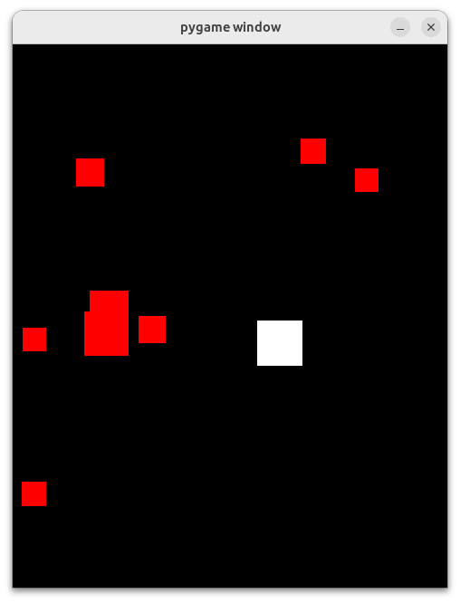

# Evade

Evade is a simple and fun game built with Python and Pygame. The goal of the game is to avoid the red blocks while controlling a white square. You can also collect green power-ups to shrink your size and make the game easier.

## Prerequisites

Before you begin, ensure you have met the following requirements:

* You have installed the latest version of Python3.
* You have a Linux or Mac machine. This code may work on Windows machines, but
  it's not guaranteed.



## Installing Evade

To install Evade, follow these steps:

1. Clone the repository:
    ```bash
    git clone https://github.com/ComputerTech312/evade.git
    ```

2. Navigate to the cloned repository:
    ```bash
    cd evade
    ```

3. Create a virtual environment:
    ```bash
    python3 -m venv venv
    ```

4. Activate the virtual environment:
    ```bash
    source venv/bin/activate
    ```

5. Install the required package (Pygame):
    ```bash
    pip install pygame
    ```

## Running the Game

To run Evade, follow these steps:

```bash
python3 evade.py
```

### Game Controls

||key|mouse|
|-|-|-|
|start new  game| ↑ | click `Start` button|
|move left|←|||
|move right|→|||
|move up|↑|||
|move down|↓|||
